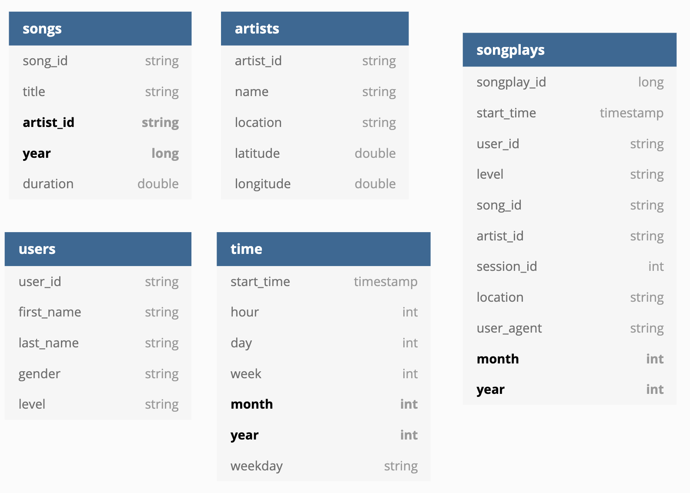

# PROJECT: DATA LAKE
## ETL PIPELINE FOR SPARKIFY DATABASE 

### by Tran Nguyen

## 1. INTRODUCTION

### 1.1. PROJECT GOAL

- Sparkify is a startup company working on a music streaming app. Through the app, Sparkify has collected information about user activity and songs, which is stored as a directory of JSON logs (`log_data` - user activity) and a directory of JSON metadata files (`song-data` - song information). These data resides in S3 on AWS `s3//udacity-den`.
- In order to improve the business growth, Sparkify wants to move their processes and data onto the Data Lake on the cloud.
- This project would be a workflow to explore and build an ETL pipeline that extracts the data from S3, processes the data into analytics tables using Spark on an AWS cluster, and loads the data back into S3 as a set of dimensional tables for the Sparkify analytics team to continue finding insights in what songs their users are listening to.

- **Note:** The dataset is not real data:
+ The `song_data` is a subset of real data from the Million Song Dataset, a freely-available collection of audio features and metadata for a million contemporary popular music tracks. Reference: http://millionsongdataset.com/
+ The `log_data` generated by an event simulator based on the songs in the dataset above. These simulate activity logs from a music streaming app based on specified configurations.

### 1.2. PROJECT WORKFLOW

- Build the ETL process step-by-step using notebook `etl-data-lake-project.ibynb`. Using local data for building the ETL process, write the output to local directory.
- Explore and use a subset of data on `s3//udacity-den` to validate the ETL process; write the output to AWS S3.
- Put all the codes together to build the script `etl.py` and run on Spark local mode, testing both the local data and a subset of data on `s3//udacity-den`. The output result from the task could be test using a jupyter notebook `test_data_lake.ipynb`.
- Build and launch an EMR cluster.
- Submit a Spark job for `etl.py` on EMR cluster, using a subset of data on `s3//udacity-den`.
- Finally, submit a Spark job for `etl.py` on EMR cluster, using a full dataset on `s3//udacity-den`.
- Provide example queries and results for song play analysis. This part was described in another jupyter notebook called `sparkifydb_data_lake_demo.ipynb`.

### 1.3.  DESIGN DATABASE SCHEMA FOR SPARKIFY

After exploring the directory of JSON logs (`s3://udacity-dend/log_data` - user activity) and a directory of JSON metadata files (`s3://udacity-dend/song_data` - song information), the dimension and fact tables for this database were designed as followed: 
Fields in **bold**: partition keys.

(ERD diagram was made by using https://dbdiagram.io/)

## 2. GETTING STARTED

### Step-by-step Instruction

## Due to Udacity Honor Code, the etl.py file and etl-data-lake-project.ipynb are not available.

These instructions will get you a copy of the project up and running the application on AWS  for development and testing purposes. 

- Clone or download the zip file of this repositories.
- Create an IAM user and insert the key and secret key into the file 'dl.cfg'.
- Modify the suitable input_data/output_data in the main function of the script file `etl.py` .
- Run `etl.py` on the terminal or on the EMR cluster.
- Validate the database by running the `test_data_lake.ipynb` notebook.
- Test the performance of the database  by running the `sparkifydb_data_lake_demo.ibynb` notebook.

### Prerequisites

-  Spark on local machine if running the program on local mode.
- EMR cluster suitable for submiting Spark application if running the program on stand alone mode.

## 3. MORE DETAILS ABOUT THE PROJECT PROCESS

### 3.1. STRUCTURE OF THE PROJECT

**This project included 4 parts:**

1. A Jupyter notebook  `etl-data-lake-project.ipynb`, which is the very detailed and lengthy notebook, provides all the information of the projetcs: 
                    + Introduction about the projects
                    + Build the ETL process step-by-step using Jupyter notebook on sample data in local directory; write output to local directory.
                    + Validate the ETL Process using the subdataset on AWS S3; write output to AWS S3.
                    + Put all the codes together to build the script etl.py and run on Spark local mode, testing both the local data and a subset of data on s3//udacity-den. The output result from the task could be test using a jupyter notebook test_data_lake.ipynb.
                    + Detail on how to build and launch an EMR cluster to submit the program on Spark stand alone mode.

2. A script version of the project as the file `etl.py`. This file need to be modified accordingly to run locally or on AWS EMR.
3. The `test_data_lake.ipynb` notebook is for validating the database after running the script version.
4. The `sparkifydb_data_lake_demo.ibynb` notebook provides example queries and results for song play analysis. 

### 3.2. SOME IMPORTANT NOTES ABOUT THE PROJECT

#### DATA COMPLEXITY

- The directory of JSON logs (`s3://udacity-dend/log-data` - user activity) has 30 log files. The total size of files, MB: 3.58
- The directory of JSON metadata files (`s3://udacity-dend/song_data` - song information) has 14896 files. The total size of files, MB: 3.54
- Note that according to the guidelines of the project, `s3://udacity-dend/` used different name format for `song_data` vs `log-data` (different in _ and -) , which is easily to be confused and make mistake.
- It took ~2.1 hrs to finished 'etl.py' for the whole dataset on the EMR cluster (1 Master node and 2 Core nodes of type m5.xlarge).
- This ETL pipeline is a long running job, in which the task "writing the `songs` table" took most of the time.

#### NOTES ABOUT THE 5 ANALYTIC TABLES

There is nothing so unsual about the 5 tables, except:

- The same user_id may have different levels in the database (free/paid).  
    + For the `users` table, the most updated level from staging_events will be kept. 
    + For the `song_plays` table, since the log file has the user level info for each song already => each song_play row will get the level from the  staging_events.

- In the `artists` table, the same artist_id may have different `name` values. This is the content problem => Need to discuss and perform a manual fix with the company. Right now,  this table is kept with some redundancy like this.

#### MODIFICATION ON THE DESIGNED ETL.PY FILE PROVIDED BY UDACITY

- Reading in song data to use for songplays table takes a lot of time, however, this task is repeat in the `process_log_data` function. I modified it by returning the song_df from the `process_song_data` funtion to use it in the `process_log_data` function.
- Import some more modules from pyspark package.
- For the `users` table, the most updated level from staging_events will be kept. So we need the timestamp column to choose the most recent "level" information => Need to add the `timestamp` column, then filter the list of `unique_users` before create the users_table.

## 4. AUTHORS

* **Tran Nguyen** 

Project dataset and project instructions were from the Data Engineering Nanodegree on Udacity. 

## 4. ACKNOWLEDGEMENTS

* This project was created as a requirement Data Lake project from the Data Engineering Nanodegree on Udacity
